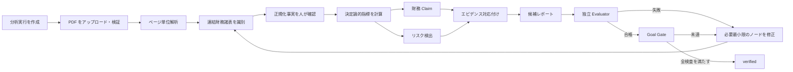

<div align="center">

<p>
  <a href="README.md"></a>
  <a href="README.zh-CN.md"></a>
  <a href="README.ja.md"></a>
</p>

# CiteFin

### エビデンス駆動型の年次報告書・財務リサーチ Agent

検索可能な中国語の年次報告書を、再計算可能な財務事実、決定論的指標、リスク所見、元 PDF ページへ戻れる構造化レポートへ変換します。

<p>
  <a href="https://github.com/RXQ6/CiteFin/actions/workflows/ci.yml"></a>
  
  
  
  
</p>

</div>

## デモ動画

<p align="center">
  <a href="docs/assets/citefin-workbench-demo.zh-CN.webm">
    
  </a>
</p>

<p align="center"><a href="docs/assets/citefin-workbench-demo.zh-CN.webm">▶ 25 秒・720p の操作デモを見る</a></p>

この動画は再現可能な F018 合成フローを使用し、実際に永続化されたバックエンド状態を表示します。ただし、実年次報告書で検証済みの精度を示すものではありません。

> [!IMPORTANT]
> CiteFin は調査支援システムです。売買、注文、送金、口座操作を実行せず、収益を保証せず、根拠のない個別投資指示も提供しません。

## プロジェクト概要

CiteFin は、リサーチャー、財務アナリスト、基礎的な財務知識を持つ個人ユーザーを対象としています。初期リリースでは、中国 A 株市場の非金融上場会社 1 社について、検索可能な中国語の年次報告書 PDF 1 件を扱います。

モデルに PDF を自由解釈させるのではなく、制約付きで監査可能な調査チェーンを構築します。

1. ユーザー提供の年次報告書を受け入れ、検証します。
2. SHA-256 でアドレス指定した不変ソースを保存し、ページテキストと表候補位置を抽出します。
3. 連結貸借対照表、連結損益計算書、連結キャッシュ・フロー計算書を特定します。
4. 正規化した財務事実の範囲、期間、通貨、単位をユーザーが確認します。
5. Decimal とバージョン管理された数式で 15 の主要指標を計算します。
6. 事実、計算、推論、リスク、制限を区別した原子的 Claim を生成します。
7. 重要な Claim を事実、指標、ルール、元 PDF ページへ接続します。
8. 独立 Evaluator が候補レポートを検査し、唯一の Goal Gate が完了可否を決定します。

モデル出力は事実の情報源ではありません。重要な数値は原文書または決定論的計算に由来する必要があります。欠損、矛盾、期限切れ、根拠不足のデータは推測せず、明示するか処理を停止します。

## 設計原則

| 原則 | エンジニアリング実装 |
| --- | --- |
| 情報源の追跡 | PDF を SHA-256 で内容アドレス化し、ページテキスト、位置情報、派生エンティティに参照を保持 |
| 再計算可能 | 金額は Decimal を使用し、指標に数式バージョン、入力事実、計算スナップショットを保存 |
| 状態を捏造しない | ワークベンチは永続化エンティティから復元し、ブラウザー側で進捗や完了を生成しない |
| 検証可能な結論 | Claim は `fact`、`calculation`、`inference`、`limitation` を明示的に区別 |
| 根拠のあるリスク | 所見に重要度、信頼度、根拠、エビデンス、制限を保存 |
| 完了ゲート | 生成側は候補だけを提出し、`verified` を書き込めるのは Goal Gate のみ |
| 操作境界 | 証券取引と接続せず、エビデンス、コンプライアンス、権限検査の回避を禁止 |

## 財務リサーチ・ワークベンチ

ワークベンチは `/` で提供され、実バックエンド API を呼び出します。

- 現在のユーザーが所有する分析実行の作成と復元。
- 不変 PDF ソースのアップロード、解析、閲覧。
- 3 つの連結財務諸表の識別結果と曖昧性理由の表示。
- F005 フォームによる財務事実の手動確認。自動フィールド抽出を完成済みとは表示しません。
- 15 指標の状態、数式バージョン、入力スナップショットの表示。
- 財務 Claim、リスク重要度、信頼度、制限の表示。
- セクション化レポートと Claim–Evidence 対応の表示。
- 保護された PDF を読み、エビデンスページへ移動。
- 独立 Evaluator、Goal Gate、Checkpoint 復元の実行。
- サーバー進捗、タスク概要、秘匿化エラー、有限 SSE イベントの表示。

現在の識別境界は `X-User-ID` です。ローカル開発用のデータ分離であり、本番認証ではありません。

## 分析ワークフロー



Checkpoint はエンティティ参照、ワークフローと状態のバージョン、ソースハッシュを保持します。復元時はソース完全性と所有権を検証し、非冪等な副作用の重複を防ぎます。型付き状態、決定論的ルーティング、Checkpoint サービスは実装済みですが、完全自動の LangGraph 実行エンジンは未実装です。

## 15 の主要指標

| 分類 | 指標 |
| --- | --- |
| 成長 | 売上高成長率、純利益成長率 |
| 収益性 | 売上総利益率、純利益率、ROA、ROE |
| レバレッジ・流動性 | 総資産負債比率、流動比率、当座比率、インタレスト・カバレッジ、現金短期債務比率 |
| キャッシュフロー | 営業キャッシュフロー / 純利益、フリーキャッシュフロー |
| 運用品質 | 売掛金成長率、棚卸資産成長率 |

入力不足または分母ゼロの場合は、無限値や捏造値ではなく、理由付きの構造化 null 状態を返します。

## 機能と受入状態

正式な状態ソースは [`FEATURES.json`](FEATURES.json) です。2026 年 9 月 8 日時点：

| 範囲 | 状態 | 実装済みの知識と機能 |
| --- | --- | --- |
| F001–F003 | `verified` | 基盤、ヘルスチェック、PDF アップロードと不変ストレージ、ページ・表候補解析 |
| F004 | `provisional` | 連結財務諸表識別、曖昧性保持、人による確認境界 |
| F005–F007 | `candidate_complete` | 事実正規化、15 の決定論的指標、Claim–Evidence モデル |
| F008–F010 | `candidate_complete` | 型付きワークフロー状態、財務 Claim、決定論的リスク所見 |
| F011–F013 | `candidate_complete` | 構造化レポート、独立 Evaluator、唯一の Goal Gate |
| F014–F015 | `candidate_complete` | Checkpoint 復元、進捗、有限 SSE イベント、カーソル再接続 |
| F016–F018 | `candidate_complete` | 完全なワークベンチ、PDF エビデンスビューアー、合成成功/失敗 E2E 受入 |

18/18 の MVP 機能にエンジニアリング実装があり、`not_started` はありません。正式な `verified` は 3 件で、残りは実データレビューまたは正式外部ゲートが必要です。

`candidate_complete` は実装と現在の機械検証の完了だけを示します。本番受入ではなく、実際の中国語年次報告書に対する精度を証明しません。

## 技術アーキテクチャ

```text
ブラウザー・ワークベンチ（HTML / CSS / JavaScript）
                         │
                         ▼
FastAPI API ── 所有権・冪等性 ── サービス層
                         │         ├─ PDF 検証・解析
                         │         ├─ 財務事実・指標
                         │         ├─ 分析・リスク・レポート
                         │         ├─ Evaluator / Goal Gate
                         │         └─ Checkpoint / Evidence
                         ▼
SQLAlchemy 2 / Alembic ── PostgreSQL 本番ベースライン
                         │
                         ├─ ローカル SHA-256 オブジェクトストレージ
                         └─ Redis（Compose 依存）
```

主な技術：Python 3.12、FastAPI、Pydantic 2、SQLAlchemy 2、Alembic、pypdf、LangChain、LangGraph、PostgreSQL 17、Redis 7.4、uv、pytest、Ruff、mypy。

## クイックスタート

必要環境：Python 3.12（対応宣言 `>=3.12,<3.14`）、[uv](https://docs.astral.sh/uv/)、Windows PowerShell または `make` 対応 POSIX 環境。

### Windows PowerShell

```powershell
git clone https://github.com/RXQ6/CiteFin.git
cd CiteFin
Copy-Item .env.example .env
.\scripts\dev.ps1 setup
.\scripts\dev.ps1 migrate
.\scripts\dev.ps1 test
.\scripts\dev.ps1 run
```

### POSIX / CI

```sh
git clone https://github.com/RXQ6/CiteFin.git
cd CiteFin
cp .env.example .env
make setup
make migrate
make test
make run
```

起動後：

- ワークベンチ：`http://127.0.0.1:8000/`
- OpenAPI：`http://127.0.0.1:8000/docs`
- ReDoc：`http://127.0.0.1:8000/redoc`
- Liveness：`http://127.0.0.1:8000/api/v1/health/live`
- Readiness：`http://127.0.0.1:8000/api/v1/health/ready`

### Docker Compose

```sh
docker compose up --build
```

API、マイグレーション、PostgreSQL 17、Redis 7.4 と、データベース・オブジェクト用永続ボリュームを起動します。

## ワークベンチの使い方

1. ローカル `X-User-ID` を入力します。
2. 会社名、6 桁の A 株コード、報告期間、分析観点を入力します。
3. 実行を作成し、暗号化されていない検索可能な中国語年次報告書 PDF をアップロードします。
4. 解析と財務諸表識別を段階的に実行します。
5. 会計範囲を確認し、正規化事実を手動で確定します。
6. 指標、分析、リスク、レポート、評価を実行します。
7. 評価合格後だけ Goal Gate を実行します。失敗時は修正理由が保持されます。
8. Claim を選び、エビデンスビューアーから元 PDF ページを確認します。

既定のアップロード上限は 50 MiB です。PDF 以外、破損、暗号化、画像のみ、テキスト不足のファイルは安定したエラーコードで拒否されます。

## API 概要

すべての分析 API は `/api/v1` を使用します。

| API グループ | 用途 |
| --- | --- |
| `analysis-runs` | 実行作成、所有実行一覧、集約ワークベンチビュー |
| `documents` | PDF アップロード、保護コンテンツ、ページ解析、財務諸表識別 |
| `financial-facts` / `metrics` | 正規化事実の確認と指標計算 |
| `financial-analysis` / `risk-detection` | エビデンス制約付き Claim とリスク所見 |
| `evidence` / `evidence-viewer` | エビデンス関係と PDF ページ解決 |
| `reports` / `evaluations` / `goal-gate` | 候補レポート、独立評価、終了ゲート |
| `checkpoints` / `progress` | 状態保存・復元、進捗、SSE イベント |

完全な Schema は実行中の `/docs` とソースコードを参照してください。

## 検証と品質ゲート

```powershell
.\scripts\dev.ps1 check
.\scripts\dev.ps1 verify-feature -Feature F018
node --check src/citefin/static/assets/app.js
```

直近の完全なエンジニアリングゲート：

- pytest 137/137 件成功。
- 分岐カバレッジ 91.40%、基準 90%。
- Ruff lint・フォーマット成功。
- 46 ソースファイルの strict mypy 成功。
- 合成ゴールデンケース 3/3 件成功。
- F018 合成成功・失敗フロー成功。
- Alembic は空 DB を `0011` まで更新でき、ORM 差分なし。
- 既知の警告は Starlette TestClient の非推奨 AnyIO エイリアスのみ。

詳細は [`docs/VALIDATION.md`](docs/VALIDATION.md) を参照してください。F018 は合成 PDF と API 経由で手動登録した事実を使用しており、実年次報告書精度や本番完了率へ外挿できません。

## データ・セキュリティ・コンプライアンス境界

- ソースは不変で、派生データはソースハッシュを参照します。
- 欠損をゼロに置換せず、矛盾する事実を暗黙に上書きしません。
- State には PDF やレポート全文ではなく参照と制御データを保存します。
- 所有権スコープにより、他ユーザーの実行、レポート、エビデンス、PDF を保護します。
- ブラウザーは `textContent` を使い、`innerHTML` を使いません。
- SSE は許可済みメタデータのみを公開し、プロンプトや秘密情報を返しません。
- MVP は外部市場データ、ニュース、自動データベンダーに依存しません。
- 事実、リスク、結論は情報源、基準時点、会計範囲とともに解釈します。

## 現在の制限と次段階

- 実年次報告書に対する Reviewer A/B の独立ブラインドレビューと裁定。
- 独立レビュー済みデータによる F004–F018 の正式 Goal Gate。
- F005 の手動確認を減らす自動表フィールド抽出。
- 完全な LangGraph 実行エンジンと自動 Checkpoint。
- 開発用 `X-User-ID` から本番認証への移行。
- 長時間イベント配信、複数インスタンス対応イベントバス、S3/MinIO。
- DB レベル監査保護、孤立オブジェクト清掃、実 readiness。
- 実年次報告書精度、ページ位置、ブラウザーマトリクスの検証。

## リポジトリ構成

```text
.
├─ src/citefin/        # FastAPI、サービス、モデル、ワークフロー、Web UI
├─ tests/              # 単体、統合、E2E、合成ゴールデンテスト
├─ migrations/         # Alembic マイグレーション
├─ scripts/            # Windows 開発入口と F005–F018 検証器
├─ docs/               # 製品、データ、決定、進捗、検証記録
├─ FEATURES.json       # 状態、依存関係、受入条件、証拠索引
├─ docker-compose.yml  # API、DB、Redis、永続ボリューム
└─ AGENTS.md           # エンジニアリング・安全制約
```

## ドキュメント

- [`FEATURES.json`](FEATURES.json)：MVP 機能の正式状態と受入条件。
- [`docs/PRODUCT_SCOPE.md`](docs/PRODUCT_SCOPE.md)：範囲、入出力、非目標、完了定義。
- [`docs/DATA_MODEL.md`](docs/DATA_MODEL.md)：事実、指標、Claim、Evidence、レポート、評価。
- [`docs/WORKFLOW.md`](docs/WORKFLOW.md)：状態、ノード、復元、Evaluator、Goal Gate。
- [`docs/PROGRESS.md`](docs/PROGRESS.md)：現在の進捗、既知問題、次の手順。
- [`docs/DECISIONS.md`](docs/DECISIONS.md)：重要なアーキテクチャ・製品判断。
- [`docs/VALIDATION.md`](docs/VALIDATION.md)：機械検証、人手レビュー境界、再現コマンド。
- [`docs/PROJECT_STATUS.en.md`](docs/PROJECT_STATUS.en.md)：簡潔な英語ステータス。

## ライセンス

`pyproject.toml` では **Proprietary** と指定されています。所有者の別途許可なしに、利用、変更、再配布の許諾があると仮定しないでください。
