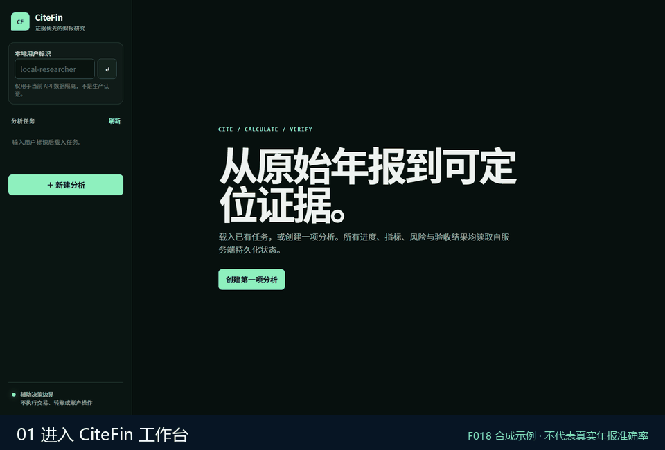
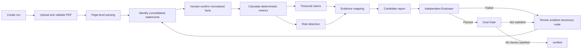

<div align="center">

<p>
  <a href="README.md"></a>
  <a href="README.zh-CN.md"></a>
  <a href="README.ja.md"></a>
</p>

# CiteFin

### An evidence-driven annual-report financial research agent

Turn searchable Chinese annual reports into reproducible financial facts, deterministic metrics, risk findings, and structured reports linked to the original PDF pages.

<p>
  <a href="https://github.com/RXQ6/CiteFin/actions/workflows/ci.yml"></a>
  
  
  
  
</p>

</div>

## Demo video

<p align="center">
  <a href="docs/assets/citefin-workbench-demo.zh-CN.webm">
    
  </a>
</p>

<p align="center"><a href="docs/assets/citefin-workbench-demo.zh-CN.webm">▶ Watch the full 25-second 720p walkthrough</a></p>

The walkthrough uses the reproducible F018 synthetic flow. It demonstrates real persisted backend state but does not represent validated accuracy on real annual reports.

> [!IMPORTANT]
> CiteFin assists research. It does not execute trades, place orders, transfer funds, operate accounts, guarantee returns, or provide unsupported personalized investment instructions.

## Overview

CiteFin is designed for researchers, financial analysts, and individual users with basic financial knowledge. The first-release scope is one searchable Chinese annual-report PDF from a non-financial A-share listed company.

It does not ask a model to freely interpret a PDF. Instead, it builds a constrained and auditable research chain:

1. Accept and validate a user-supplied annual report.
2. Store an immutable SHA-256-addressed source and extract page text and table-candidate locations.
3. Locate the consolidated balance sheet, income statement, and cash-flow statement.
4. Let a user confirm normalized fact scope, period, currency, and unit.
5. Calculate 15 metrics with Decimal values and versioned formulas.
6. Produce atomic claims that distinguish facts, calculations, inferences, risks, and limitations.
7. Link material claims to facts, metrics, rules, and original PDF pages.
8. Let an independent Evaluator inspect the candidate report before the sole Goal Gate decides whether completion is allowed.

Model output is not a source of truth. Material figures must come from the source document or deterministic calculations. Missing, conflicting, stale, or unsupported data must be disclosed or block the workflow instead of being guessed.

## Design principles

| Principle | Engineering implementation |
| --- | --- |
| Traceable sources | PDFs use SHA-256 content addressing; page text, locators, and derived entities retain source references |
| Reproducible calculations | Monetary values use Decimal; metrics retain formula versions, input facts, and calculation snapshots |
| No fabricated state | The workbench restores persisted entities and never invents browser-side progress or completion |
| Reviewable conclusions | Claims separate `fact`, `calculation`, `inference`, and `limitation` |
| Evidence-backed risks | Findings include severity, confidence, rationale, evidence, and limitations |
| Gated completion | Generators submit candidates; only the Goal Gate can write `verified` |
| Bounded operation | No brokerage integration and no bypass of evidence, compliance, or permission checks |

## Financial research workbench

The workbench is served at `/` and calls the project's real backend APIs. It can:

- Create and restore analysis runs owned by the current user.
- Upload, parse, and view immutable PDF sources.
- Show identification results and ambiguity reasons for the three consolidated statements.
- Confirm financial facts through the F005 form; automatic field extraction is not presented as complete.
- Show all 15 metrics with status, formula version, and input snapshot.
- Display financial claims, risk severity, confidence, and limitations.
- Render sectioned reports and Claim–Evidence mappings.
- Read protected PDF content and jump to an evidence page.
- Run the independent Evaluator, Goal Gate, and Checkpoint recovery operations.
- Show server-side progress, task summaries, sanitized errors, and bounded SSE lifecycle events.

The current identity boundary is `X-User-ID`. It provides local-development isolation and is not production authentication.

## Analysis workflow



Checkpoints retain entity references, workflow and state versions, and source hashes. Recovery validates source integrity and ownership while preventing duplicate non-idempotent side effects. Typed state, deterministic routing, and Checkpoint services are implemented; a complete automatic LangGraph executor is not.

## The 15 core metrics

| Category | Metrics |
| --- | --- |
| Growth | Revenue growth, net-profit growth |
| Profitability | Gross margin, net margin, ROA, ROE |
| Leverage and liquidity | Debt-to-assets, current ratio, quick ratio, interest coverage, cash-to-short-term-debt |
| Cash flow | Operating cash flow / net profit, free cash flow |
| Operating quality | Accounts-receivable growth, inventory growth |

If an input is missing or a denominator is zero, the engine returns a structured null state with a reason instead of infinity or a fabricated value.

## Feature and acceptance status

[`FEATURES.json`](FEATURES.json) is authoritative. As of September 8, 2026:

| Scope | Status | Delivered knowledge and capability |
| --- | --- | --- |
| F001–F003 | `verified` | Baseline, health checks, PDF upload and immutable storage, page and table-candidate parsing |
| F004 | `provisional` | Consolidated-statement identification, ambiguity preservation, and human-confirmation boundaries |
| F005–F007 | `candidate_complete` | Fact normalization, 15 deterministic metrics, and the Claim–Evidence model |
| F008–F010 | `candidate_complete` | Typed workflow state, financial claims, and deterministic risk findings |
| F011–F013 | `candidate_complete` | Structured reports, independent Evaluator, and sole Goal Gate |
| F014–F015 | `candidate_complete` | Checkpoint recovery, progress, bounded SSE events, and cursor reconnection |
| F016–F018 | `candidate_complete` | Complete workbench, page-level PDF evidence viewer, and synthetic success/failure E2E acceptance |

All 18 MVP features have engineering implementations; none are `not_started`. Three are formally `verified`. The others still require real-data review or formal external gating.

`candidate_complete` means implementation and current machine checks are complete. It is not production acceptance and does not establish accuracy for real Chinese annual reports.

## Architecture

```text
Browser workbench (HTML / CSS / JavaScript)
                    │
                    ▼
FastAPI API ── ownership and idempotency ── service layer
                    │                         ├─ PDF validation and parsing
                    │                         ├─ facts and metrics
                    │                         ├─ analysis, risks, and reports
                    │                         ├─ Evaluator / Goal Gate
                    │                         └─ Checkpoints / Evidence
                    ▼
SQLAlchemy 2 / Alembic ── PostgreSQL production baseline
                    │
                    ├─ local SHA-256 object storage
                    └─ Redis Compose dependency
```

Core technologies: Python 3.12, FastAPI, Pydantic 2, SQLAlchemy 2, Alembic, pypdf, LangChain, LangGraph, PostgreSQL 17, Redis 7.4, uv, pytest, Ruff, and mypy.

## Quick start

Requirements: Python 3.12 (declared range `>=3.12,<3.14`), [uv](https://docs.astral.sh/uv/), and Windows PowerShell or a POSIX environment with `make`.

### Windows PowerShell

```powershell
git clone https://github.com/RXQ6/CiteFin.git
cd CiteFin
Copy-Item .env.example .env
.\scripts\dev.ps1 setup
.\scripts\dev.ps1 migrate
.\scripts\dev.ps1 test
.\scripts\dev.ps1 run
```

### POSIX / CI

```sh
git clone https://github.com/RXQ6/CiteFin.git
cd CiteFin
cp .env.example .env
make setup
make migrate
make test
make run
```

After startup:

- Workbench: `http://127.0.0.1:8000/`
- OpenAPI: `http://127.0.0.1:8000/docs`
- ReDoc: `http://127.0.0.1:8000/redoc`
- Liveness: `http://127.0.0.1:8000/api/v1/health/live`
- Readiness: `http://127.0.0.1:8000/api/v1/health/ready`

### Docker Compose

```sh
docker compose up --build
```

Compose starts the API, migration job, PostgreSQL 17, and Redis 7.4, with persistent volumes for the database and object files.

## Using the workbench

1. Enter a local `X-User-ID`.
2. Supply a company name, six-digit A-share code, report period, and analysis focus.
3. Create a run and upload an unencrypted, searchable Chinese annual-report PDF.
4. Run parsing and statement identification in stages.
5. Review the accounting scope and confirm normalized facts manually.
6. Run metrics, analysis, risks, report generation, and evaluation.
7. Invoke the Goal Gate only after evaluation checks pass; failures retain repair reasons.
8. Select a claim and use the evidence viewer to return to its source PDF page.

The default upload limit is 50 MiB. Non-PDF, malformed, encrypted, image-only, or text-insufficient files are rejected with stable error codes.

## API overview

All analysis APIs use `/api/v1`.

| API group | Purpose |
| --- | --- |
| `analysis-runs` | Create runs, list owned runs, and read the aggregate workbench view |
| `documents` | Upload PDFs, read protected content, parse pages, and identify statements |
| `financial-facts` / `metrics` | Confirm normalized facts and calculate versioned metrics |
| `financial-analysis` / `risk-detection` | Generate evidence-constrained claims and risk findings |
| `evidence` / `evidence-viewer` | Create evidence relationships and resolve them to PDF pages |
| `reports` / `evaluations` / `goal-gate` | Build candidate reports, evaluate independently, and enforce the terminal gate |
| `checkpoints` / `progress` | Save or restore state and query progress or SSE events |

Use the running `/docs` page and source code for the complete schemas.

## Verification and quality gate

```powershell
.\scripts\dev.ps1 check
.\scripts\dev.ps1 verify-feature -Feature F018
node --check src/citefin/static/assets/app.js
```

Most recently recorded complete engineering gate:

- 137/137 pytest tests passed.
- 91.40% branch coverage against a 90% threshold.
- Ruff lint and formatting passed.
- Strict mypy passed across 46 source files.
- 3/3 synthetic golden cases passed.
- F018 synthetic success and failure flows passed.
- Alembic upgrades an empty database through revision `0011` with no ORM migration drift.
- The only known warning is Starlette TestClient's use of a deprecated AnyIO alias.

See [`docs/VALIDATION.md`](docs/VALIDATION.md). F018 uses synthetic PDFs and facts manually submitted through the API; its results cannot be extrapolated to real-report accuracy or production completion rates.

## Data, security, and compliance boundaries

- Sources are immutable and derived data references source hashes.
- Missing facts are not replaced with zero; conflicts are not silently overwritten.
- State stores references and control data, not copied PDFs or complete report bodies.
- Ownership-scoped queries prevent cross-user access to runs, reports, evidence, and PDFs.
- The browser renders server text with DOM `textContent`, not `innerHTML`.
- SSE exposes allow-listed metadata, not prompts, secrets, or complete internal errors.
- The MVP does not depend on external market feeds, news, or automatic data vendors.
- Facts, risks, and conclusions must retain source, cutoff time, and accounting scope.

## Current limitations and next stage

Formal production readiness still requires:

- Independent Reviewer A/B blind review and adjudication of sealed real annual reports.
- Formal Goal Gate evidence for F004–F018 using independently reviewed data.
- Automatic table-field extraction to reduce F005 manual confirmation.
- A complete LangGraph executor and automatic Checkpoints after required nodes.
- Production authentication instead of development-only `X-User-ID`.
- Long-lived event streaming, a multi-instance event bus, and S3/MinIO object storage.
- Database-level immutable audit permissions, orphan-object cleanup, and real readiness probes.
- Real-report accuracy, page-level evidence-location, and browser-matrix validation.

## Repository layout

```text
.
├─ src/citefin/        # FastAPI, services, models, workflow, and web workbench
├─ tests/              # Unit, integration, E2E, and synthetic golden tests
├─ migrations/         # Alembic database migrations
├─ scripts/            # Windows entry point and F005–F018 verifiers
├─ docs/               # Product, data, workflow, decision, progress, and validation records
├─ FEATURES.json       # Status, dependencies, acceptance criteria, and evidence index
├─ docker-compose.yml  # API, migration, PostgreSQL, Redis, and volumes
└─ AGENTS.md           # Engineering and safety constraints
```

## Documentation

- [`FEATURES.json`](FEATURES.json): authoritative feature states and acceptance criteria.
- [`docs/PRODUCT_SCOPE.md`](docs/PRODUCT_SCOPE.md): scope, inputs, outputs, non-goals, and definition of done.
- [`docs/DATA_MODEL.md`](docs/DATA_MODEL.md): facts, metrics, Claims, Evidence, reports, and evaluations.
- [`docs/WORKFLOW.md`](docs/WORKFLOW.md): state, nodes, recovery, Evaluator, and Goal Gate.
- [`docs/PROGRESS.md`](docs/PROGRESS.md): current progress, known issues, and next steps.
- [`docs/DECISIONS.md`](docs/DECISIONS.md): material architecture and product decisions.
- [`docs/VALIDATION.md`](docs/VALIDATION.md): checks, human-review boundaries, and reproduction commands.
- [`docs/PROJECT_STATUS.en.md`](docs/PROJECT_STATUS.en.md): concise English status summary.

## License

The project is marked **Proprietary** in `pyproject.toml`. Do not assume permission to use, modify, or redistribute it unless the repository owner grants that permission separately.
