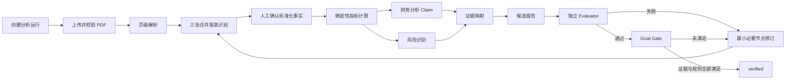

<div align="center">

<p>
  <a href="README.md"></a>
  <a href="README.zh-CN.md"></a>
  <a href="README.ja.md"></a>
</p>

# CiteFin

### 证据驱动的年度报告财务研究 Agent

把可检索的中文年报转化为可复算的财务事实、确定性指标、风险发现和可回到原始 PDF 页面的结构化报告。

<p>
  <a href="https://github.com/RXQ6/CiteFin/actions/workflows/ci.yml"></a>
  
  
  
  
</p>

</div>

## 示例视频

<p align="center">
  <a href="docs/assets/citefin-workbench-demo.zh-CN.webm">
    
  </a>
</p>

<p align="center"><a href="docs/assets/citefin-workbench-demo.zh-CN.webm">▶ 查看完整 25 秒 720p 操作演示</a></p>

视频使用可复现的 F018 合成流程，展示真实持久化后端状态，但不代表已经验证真实年报准确率。

> [!IMPORTANT]
> CiteFin 是研究辅助系统，不执行交易、下单、转账或账户操作，不承诺收益，也不提供缺乏证据的个性化买卖指令。

## 项目概览

CiteFin 面向研究人员、财务分析人员和具备基础财务知识的个人用户。首期场景聚焦于单家 A 股非金融类上市公司的中文、可检索文本年度报告。

它解决的核心问题不是“让模型自由解读一份 PDF”，而是建立一条受约束、可审计的研究链路：

1. 接收并校验用户上传的年度报告。
2. 以 SHA-256 保存不可变来源对象，并提取页级文本和表格候选位置。
3. 定位合并资产负债表、合并利润表和合并现金流量表。
4. 由用户确认标准化财务事实的口径、期间、币种和单位。
5. 使用 Decimal 和版本化公式计算 15 项核心指标。
6. 生成区分事实、计算、推断、风险和限制的原子 Claim。
7. 将重大 Claim 连接到事实、指标、规则和原始 PDF 页码。
8. 由独立 Evaluator 检查候选报告，并由唯一 Goal Gate 决定是否允许完成。

模型输出不是事实来源。重要数字必须来自原始文档或确定性计算；数据缺失、冲突或证据不足时，系统必须披露或停止，而不是猜测。

## 为什么是 CiteFin

| 原则 | 工程实现 |
| --- | --- |
| 来源可追溯 | 原始 PDF 使用 SHA-256 内容寻址，页文本、定位信息和派生实体保留来源引用 |
| 计算可复算 | 金额使用 Decimal；指标保存公式版本、输入事实和计算快照 |
| 状态不伪造 | 工作台从持久化实体恢复，不在浏览器端模拟进度或完成状态 |
| 结论可检查 | Claim 明确区分 `fact`、`calculation`、`inference` 和 `limitation` |
| 风险有依据 | 风险项保存严重度、置信度、规则/指标依据、证据与限制 |
| 完成受门禁 | 生成模块只能提交候选结果；只有 Goal Gate 可以写入 `verified` |
| 操作有边界 | 不接入券商交易，不允许绕过证据、合规和权限检查 |

## 完整工作台

浏览器工作台位于 `/`，直接调用项目已有的真实后端 API。它支持：

- 创建并恢复当前用户拥有的分析运行。
- 上传、解析和查看不可变 PDF 来源。
- 显示三张合并财务报表的识别结果和歧义原因。
- 通过 F005 表单人工确认财务事实；当前没有伪装成自动完成的字段抽取。
- 查看 15 项指标的状态、公式版本和输入快照。
- 查看财务分析 Claim、风险严重度、置信度和限制。
- 查看分区报告以及 Claim–Evidence 映射。
- 打开受保护的 PDF 内容，并跳转到证据页。
- 执行独立 Evaluator、Goal Gate 和 Checkpoint 恢复。
- 查看服务端进度、任务摘要、脱敏错误和有限 SSE 生命周期事件。

当前身份边界使用 `X-User-ID`，仅用于本地开发和用户数据隔离，不是生产认证方案。

## 分析流程



Checkpoint 保存运行引用、工作流版本、状态版本和来源哈希。恢复时会校验来源完整性和用户归属，并避免重复创建非幂等副作用。当前项目实现了类型化状态、确定性路由和 Checkpoint 服务，但尚未实现完整的自动 LangGraph 执行器。

## 15 项核心指标

| 类别 | 指标 |
| --- | --- |
| 增长 | 营业收入增长率、净利润增长率 |
| 盈利能力 | 毛利率、净利率、ROA、ROE |
| 杠杆与偿债 | 资产负债率、流动比率、速动比率、利息保障倍数、现金短债比 |
| 现金流 | 经营现金流/净利润、自由现金流 |
| 经营质量 | 应收账款增长率、存货增长率 |

缺少输入或分母为零时，指标返回带原因的结构化空状态，不输出无穷大或补造数值。

## 功能与验收状态

状态的权威来源是 [`FEATURES.json`](FEATURES.json)。截至 2026-09-08：

| 范围 | 状态 | 已实现知识与能力 |
| --- | --- | --- |
| F001–F003 | `verified` | 工程基线、健康检查、PDF 上传与不可变存储、分页文本和表格候选解析 |
| F004 | `provisional` | 三张合并财务报表识别、歧义保留和人工确认边界 |
| F005–F007 | `candidate_complete` | 财务事实标准化、15 项确定性指标、Claim–Evidence 数据模型 |
| F008–F010 | `candidate_complete` | 类型化工作流状态、财务分析 Claim、确定性风险发现 |
| F011–F013 | `candidate_complete` | 结构化报告、独立 Evaluator、唯一 Goal Gate |
| F014–F015 | `candidate_complete` | Checkpoint 恢复、运行进度、有限 SSE 事件与游标重连 |
| F016–F018 | `candidate_complete` | 完整工作台、页级 PDF 证据查看、合成成功/失败端到端验收 |

18/18 个 MVP 功能已有工程实现，没有 `not_started` 项。其中 3 个已正式 `verified`，其余功能仍等待真实数据复核或正式外部门禁。

`candidate_complete` 仅表示工程实现和现有机器检查完成，不等于生产验收，不证明真实中文年报的事实提取、风险判断、报告质量或证据定位准确率。

## 技术架构

```text
浏览器工作台（HTML / CSS / JavaScript）
                 │
                 ▼
FastAPI API ── 用户范围与幂等控制 ── 服务层
                 │                     ├─ PDF 校验与解析
                 │                     ├─ 财务事实与指标
                 │                     ├─ 分析、风险与报告
                 │                     ├─ Evaluator / Goal Gate
                 │                     └─ Checkpoint / Evidence
                 ▼
SQLAlchemy 2 / Alembic ── PostgreSQL（生产基线）
                 │
                 ├─ 本地 SHA-256 对象存储
                 └─ Redis（Compose 运行依赖）
```

主要技术：Python 3.12、FastAPI、Pydantic 2、SQLAlchemy 2、Alembic、pypdf、LangChain、LangGraph、PostgreSQL 17、Redis 7.4、uv、pytest、Ruff 和 mypy。

## 快速开始

### 前置条件

- Python 3.12（项目声明支持 `>=3.12,<3.14`）
- [uv](https://docs.astral.sh/uv/)
- Windows PowerShell，或支持 `make` 的 POSIX 环境

### Windows PowerShell

```powershell
git clone https://github.com/RXQ6/CiteFin.git
cd CiteFin
Copy-Item .env.example .env
.\scripts\dev.ps1 setup
.\scripts\dev.ps1 migrate
.\scripts\dev.ps1 test
.\scripts\dev.ps1 run
```

### POSIX / CI

```sh
git clone https://github.com/RXQ6/CiteFin.git
cd CiteFin
cp .env.example .env
make setup
make migrate
make test
make run
```

启动后可以访问：

- 工作台：`http://127.0.0.1:8000/`
- OpenAPI：`http://127.0.0.1:8000/docs`
- ReDoc：`http://127.0.0.1:8000/redoc`
- Liveness：`http://127.0.0.1:8000/api/v1/health/live`
- Readiness：`http://127.0.0.1:8000/api/v1/health/ready`

### Docker Compose

```sh
docker compose up --build
```

Compose 会启动 API、迁移任务、PostgreSQL 17 和 Redis 7.4，并为数据库和对象文件建立持久卷。

## 使用工作台

1. 在首页输入本地 `X-User-ID`。
2. 填写公司名称、六位 A 股证券代码、报告期和分析关注点。
3. 创建分析运行并上传一份中文、未加密、可检索文本的年度报告 PDF。
4. 按界面阶段执行解析和三表识别。
5. 检查口径后，通过人工表单确认标准化事实。
6. 执行指标、分析、风险、报告和 Evaluator。
7. 只有评测检查通过时才执行 Goal Gate；失败结果会保留修订原因。
8. 在报告中选择 Claim，通过证据查看器返回原始 PDF 页进行复核。

默认上传上限为 50 MiB。非 PDF、损坏、加密、图片型或文本不足的文件会以稳定错误码拒绝。

## API 概览

所有分析 API 使用 `/api/v1` 前缀。主要能力包括：

| API 组 | 用途 |
| --- | --- |
| `analysis-runs` | 创建运行、列出用户运行、读取工作台聚合视图 |
| `documents` | 上传 PDF、读取受保护内容、解析页面、识别三张报表 |
| `financial-facts` / `metrics` | 确认标准化事实并计算版本化指标 |
| `financial-analysis` / `risk-detection` | 生成证据受控的 Claim 和风险发现 |
| `evidence` / `evidence-viewer` | 建立证据关系并解析到 PDF 页级来源 |
| `reports` / `evaluations` / `goal-gate` | 生成候选报告、独立评测并执行唯一终止门禁 |
| `checkpoints` / `progress` | 保存或恢复状态，查询进度与 SSE 生命周期事件 |

完整请求和响应 Schema 以运行中的 `/docs` 和源码为准。

## 验证与质量门禁

```powershell
.\scripts\dev.ps1 check
.\scripts\dev.ps1 verify-feature -Feature F018
node --check src/citefin/static/assets/app.js
```

最近记录的完整工程门禁结果：

- pytest：137/137 通过。
- 分支覆盖率：91.40%，门槛为 90%。
- Ruff lint 与格式检查通过。
- 严格 mypy 检查 46 个源码文件通过。
- 3/3 合成黄金用例通过。
- F018 合成成功/失败流程通过。
- Alembic 可从空库升级到 `0011`，且没有 ORM 迁移漂移。
- 唯一已知测试警告为 Starlette TestClient 使用 AnyIO 已弃用别名。

详细证据见 [`docs/VALIDATION.md`](docs/VALIDATION.md)。F018 使用合成 PDF 和人工经 API 提交的事实，不能外推为真实年报准确率或生产完成率。

## 数据、安全与合规边界

- 原始文件不可变，派生数据必须引用来源哈希。
- 不把缺失事实替换为零，不静默覆盖冲突事实。
- 不在 State 中复制 PDF 或完整报告正文，只保存实体引用和控制状态。
- 用户范围查询阻止跨用户读取运行、报告、证据和 PDF。
- 浏览器使用 DOM `textContent` 渲染服务端文本，不使用 `innerHTML`。
- SSE 只暴露白名单元数据，不返回提示词、密钥或完整内部错误载荷。
- MVP 默认不依赖外部行情、新闻或自动数据供应商。
- 任何事实、风险和报告结论都不能脱离来源、截至时间和口径解释。

## 当前限制与下一阶段

要达到正式生产可用，仍需完成：

- 对已封存的真实年报执行 Reviewer A/B 双人独立盲审和冲突裁决。
- 使用独立证据完成 F004–F018 正式 Goal Gate。
- 实现自动表格字段抽取，减少 F005 人工确认工作。
- 实现完整 LangGraph 自动执行器及各必要节点后的自动 Checkpoint。
- 用正式认证主体替换开发用 `X-User-ID`。
- 增加生产级长连接事件推送、多实例事件总线和 S3/MinIO 对象存储。
- 增加数据库层不可变审计权限、孤儿对象安全清理和真实连接 readiness。
- 完成真实年报准确率、页级证据定位和生产浏览器矩阵验证。

## 项目结构

```text
.
├─ src/citefin/        # FastAPI、领域服务、数据模型、工作流与静态工作台
├─ tests/              # 单元、集成、端到端和合成黄金用例
├─ migrations/         # Alembic 数据库迁移
├─ scripts/            # Windows 开发入口和 F005–F018 专项验证器
├─ docs/               # 产品、数据、工作流、决策、进度与验证记录
├─ FEATURES.json       # 功能状态、依赖、验收条件和证据索引
├─ docker-compose.yml  # API、迁移、PostgreSQL、Redis 和持久卷
└─ AGENTS.md           # 项目级工程与安全约束
```

## 项目文档

- [`FEATURES.json`](FEATURES.json)：18 个 MVP 功能的权威状态和验收条件。
- [`docs/PRODUCT_SCOPE.md`](docs/PRODUCT_SCOPE.md)：首期场景、输入输出、非目标与完成定义。
- [`docs/DATA_MODEL.md`](docs/DATA_MODEL.md)：事实、指标、Claim、Evidence、报告和评测模型。
- [`docs/WORKFLOW.md`](docs/WORKFLOW.md)：状态、节点、恢复、Evaluator 和 Goal Gate。
- [`docs/PROGRESS.md`](docs/PROGRESS.md)：当前进度、已知问题与下一步。
- [`docs/DECISIONS.md`](docs/DECISIONS.md)：关键架构和产品决策。
- [`docs/VALIDATION.md`](docs/VALIDATION.md)：机器验证、人工复核边界与复现命令。
- [`docs/PROJECT_STATUS.zh-CN.md`](docs/PROJECT_STATUS.zh-CN.md)：简明中文状态摘要。

## 许可证

当前 `pyproject.toml` 将本项目标记为 **Proprietary**。除非仓库所有者另行授权，不应假定存在开源使用、修改或再分发许可。
