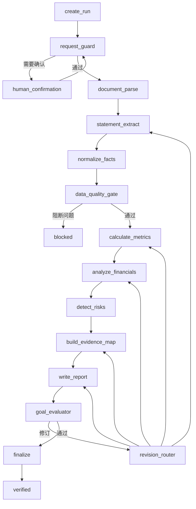

# MVP 工作流

## 1. 工作流目标

将一份用户上传的年度报告转换为可验证的结构化财务事实、确定性指标、风险发现和带证据报告。工作流由 LangGraph 编排，但状态转换、权限、验收和持久化由 Harness 约束。

## 2. 核心循环

```text
messages/state
  → 上下文准备
  → LLM 或规则决定下一动作
  → PreToolUse Hook
  → Permission Gate
  → Tool Handler
  → PostToolUse Hook
  → tool_result 写回 state
  → 下一轮或 Goal Gate
```

LLM 不直接访问文件、数据库或计算模块。所有能力必须注册为工具或确定性工作流节点。

## 3. FinanceAgentState

| 字段 | 说明 | 写入者 |
| --- | --- | --- |
| `run_id` | 分析运行 ID | API，仅初始化 |
| `thread_id` | LangGraph 持久化线程 | API，仅初始化 |
| `as_of` | 分析信息截止时间 | API，仅初始化 |
| `company` | 公司名称、代码和确认状态 | 请求校验节点 |
| `report_period` | 报告期间 | 请求校验节点 |
| `source_documents` | 来源 ID 与解析状态 | 文档节点 |
| `tasks` | 当前任务图摘要 | Harness Task System |
| `financial_facts` | 事实 ID，不在 State 内复制全文 | 标准化节点 |
| `metrics` | 指标 ID | 计算节点 |
| `risk_findings` | 风险 ID | 风险节点 |
| `claims` | 原子结论 ID | 分析与报告节点 |
| `evidence_map` | Claim 到 Evidence 的映射 | 证据节点 |
| `report_id` | 当前报告版本 | 报告节点 |
| `evaluation_id` | 最近评测 | Evaluator |
| `errors` | 结构化错误列表 | 所有节点 |
| `retry_budget` | 节点重试预算 | Harness |
| `current_node` | 当前节点 | LangGraph |
| `status` | 运行状态 | Harness/Goal Gate |

State 只保存引用和控制状态；原始 PDF、页面文本、事实表和报告正文写入专用存储。

## 4. 主工作流



## 5. 节点契约

### 5.1 create_run

- 输入：用户、幂等键、上传文件引用、公司、报告期、关注点。
- 输出：`AnalysisRun`、根任务、`run_id`、`thread_id`。
- 副作用：写入审计事件和初始 Checkpoint。
- 失败：幂等冲突返回原运行；非法请求拒绝。

### 5.2 request_guard

- 校验文件类型、文件大小、公司代码、报告期和 `as_of`。
- 对比用户输入与文档封面信息。
- 冲突可消除则规范化；不可消除则进入 `human_confirmation`。
- 不调用 LLM 生成金融结论。

### 5.3 document_parse

- 读取不可变 PDF，提取页级文本与表格坐标。
- 验证 PDF 为可检索文本、非加密、页数合理。
- 保存解析器版本、页文本哈希和错误页。
- 整体失败不自动换用未经批准的外部 OCR 服务。

### 5.4 statement_extract

- 定位合并资产负债表、合并利润表和合并现金流量表。
- 提取本期与上期的必需字段及定位信息。
- 输出 `FinancialFact(validation_status=extracted)`。
- 发现多个候选表或口径冲突时输出结构化冲突，不做静默选择。

### 5.5 normalize_facts

- 统一概念名、币种、披露单位、符号、期间和合并口径。
- 生成 `normalized_value`，保留 `raw_value`。
- 规则通过后将事实标为 `confirmed`。
- 禁止将缺失值替换为 0。

### 5.6 data_quality_gate

至少执行：

- 必需字段完整性。
- 事实粒度唯一性。
- 期间、币种、单位和口径有效性。
- 资产=负债+权益、毛利润=收入-成本等勾稽。
- 来源发布时间不晚于 `as_of`。

阻断级问题进入 `blocked`；非阻断问题生成 `data_quality` 风险和限制说明。

### 5.7 calculate_metrics

- 根据版本化 `MetricDefinition` 读取确认事实。
- 使用 Decimal 执行计算并保存输入快照。
- 缺失输入或零分母时返回带原因的 `null`，不得输出无穷大或猜测值。
- 相同事实与公式版本必须产生相同结果。

### 5.8 analyze_financials

- 输入仅包含已确认事实、已计算指标和必要上下文。
- 生成原子 `Claim`，明确 `fact/calculation/inference/limitation` 类型。
- 不得生成无法关联事实或指标的重大数字结论。

### 5.9 detect_risks

- 先运行确定性风险规则，再允许 LLM 对规则结果作解释。
- 首期风险包括：收入或利润下降、现金流与利润背离、短期偿债压力、应收或存货异常增长、利息保障不足和数据质量风险。
- 每项风险必须引用 Claim、指标或事实。

### 5.10 build_evidence_map

- 为每条重大 Claim 建立 Evidence。
- 检查页码、行列定位、事实 ID 和指标 ID 是否存在。
- 区分 `supports`、`contradicts` 和 `qualifies`。
- 重大 Claim 无证据时不得进入报告候选状态。

### 5.11 write_report

- 读取结构化事实、指标、风险、Claim 和 Evidence。
- 输出符合版本化 Schema 的报告，不直接读取原始 PDF 自由发挥。
- 保存模型、提示模板和报告版本。
- 完成后状态只能为 `candidate_complete`。

### 5.12 goal_evaluator

Evaluator 与生成器使用独立提示和独立调用，不得调用业务工具。

必需检查：

- 三张报表与核心字段完整性。
- 15 项指标状态与计算轨迹。
- 重大数字和结论证据覆盖率。
- 引用是否真正支持对应 Claim。
- 事实、计算、推断、限制是否正确区分。
- 是否存在编造、过度确定表达或投资指令。
- 所有任务是否满足验收条件。
- Checkpoint、Journal 和审计事件是否完整。

通过时由 Goal Gate 设置 `verified`；失败时返回 `node_hint`、`error_code`、`evidence` 和 `repair_instruction`。

### 5.13 revision_router

根据评测错误回到最小必要节点：

| 错误类型 | 返回节点 |
| --- | --- |
| `missing_fact`、`wrong_locator` | `statement_extract` |
| `unit_conflict`、`period_conflict` | `normalize_facts` |
| `formula_error` | `calculate_metrics` |
| `unsupported_inference` | `analyze_financials` |
| `missing_evidence` | `build_evidence_map` |
| `report_schema`、`wording_violation` | `write_report` |

禁止无原因从头重跑整个工作流。

### 5.14 finalize

- 冻结已验证报告版本。
- 写入报告、证据包、Evaluation、最终 Checkpoint 和完成事件。
- 生成可供前端查询的摘要。
- 只有该节点成功后，API 才返回完成状态。

## 6. Task System

首期任务 DAG：

```text
T01 请求与身份校验
 └─ T02 文档解析
     └─ T03 三表提取
         └─ T04 标准化与质量校验
             └─ T05 指标计算
                 ├─ T06 财务分析
                 └─ T07 风险识别
                     └─ T08 证据映射
                         └─ T09 报告生成
                             └─ T10 独立验收
                                 └─ T11 结果持久化
```

规则：

- 单个执行者 WIP=1。
- `blocked_by` 未清空时不能进入 `ready`。
- 执行者只能设置 `candidate_complete`。
- Validator 执行验收后才能设置 `verified`。
- 状态迁移和所有者变化必须写入 AuditEvent。

## 7. Hooks 与权限

### 7.1 UserPromptSubmit

- 注入 `run_id`、`as_of`、产品边界和当前任务。
- 拦截交易、资金操作和绕过验证的要求。

### 7.2 PreToolUse

- 校验工具是否登记、参数 Schema、运行归属和任务归属。
- 文件读取只能访问当前运行的不可变来源对象。
- 数据库写入只允许对应仓储接口，禁止模型执行任意 SQL。
- 所有外部网络工具在 MVP 默认拒绝。

### 7.3 PostToolUse

- 记录耗时、输入摘要、输出摘要、版本和错误。
- 对输出执行 Schema、大小、敏感信息和来源检查。
- 大输出写入对象存储，State 只保存引用。

### 7.4 Stop

- 检查活动任务、后台工作、运行状态和 Goal Gate。
- 工作 Agent 声称完成但未通过 Evaluator 时，阻止返回并注入修复原因。

## 8. 重试、超时与错误

### 8.1 错误分类

- `INPUT_*`: 用户输入或文件问题，通常不重试。
- `PARSER_*`: 文档解析问题，同版本最多重试 1 次。
- `DATA_*`: 数据缺失、冲突或勾稽失败，不盲目重试。
- `MODEL_*`: 超时或结构化输出失败，指数退避，最多 2 次。
- `TOOL_*`: 工具不可用或契约失败，按幂等性决定重试。
- `EVAL_*`: 验收失败，路由到最小修订节点。
- `SYSTEM_*`: 持久化或状态损坏，立即阻断并告警。

### 8.2 重试原则

- 只有可恢复、幂等且原因明确的失败可以自动重试。
- 每次重试保存原因和尝试次数。
- 同一错误连续出现达到预算后进入 `blocked`，不能无限循环。

## 9. Checkpoint 与恢复

在以下位置保存 Checkpoint：

- 运行创建后。
- 文档解析完成后。
- 财务事实确认后。
- 指标计算完成后。
- 报告候选版本生成后。
- 每次 Evaluation 后。
- 最终完成前。

恢复时先校验工作流版本、来源哈希和状态版本。确定性节点可从已持久化结果复用；模型节点只有在输入语义键相同且缓存仍有效时复用。

## 10. 可观测性

每个事件至少包含：

```text
run_id, task_id, trace_id, node, event_type,
tool_name, model_profile, source_id, duration_ms,
status, error_code, created_at
```

前端通过 SSE 接收生命周期事件：`run_started`、`node_started`、`node_completed`、`task_blocked`、`awaiting_user`、`evaluation_failed`、`run_verified`、`run_failed`。

